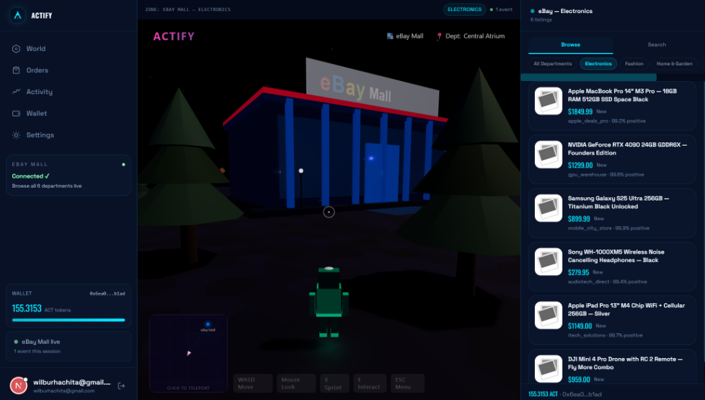
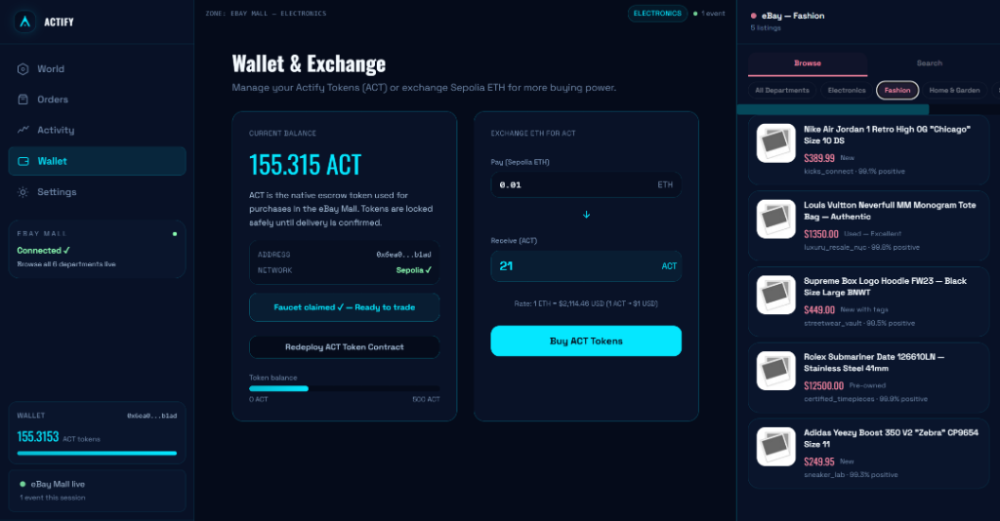
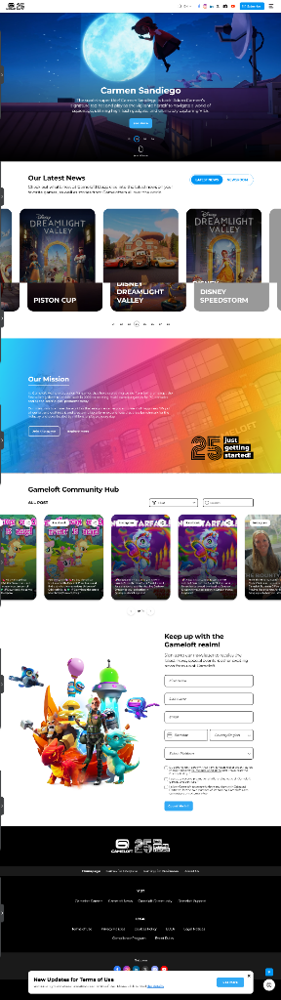
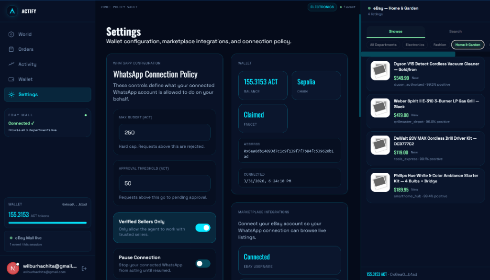

# Actify AI

Actify AI is a game-like commerce dashboard where a user can browse a live marketplace, manage an ACT token wallet, buy through escrow-style purchase flows, and control a WhatsApp AI agent that can recommend or prepare purchases on the user's behalf.

This guide is written for both technical and non-technical testers.
If you can follow a checklist, you can get this project running.

## What The Product Does

Actify AI combines five things in one experience:

1. A world view where the marketplace feels like a playable mall.
2. A right-side product panel for browsing and buying listings.
3. An ACT wallet for test purchases and escrow-style locking.
4. An activity feed so you can see what happened and when.
5. A WhatsApp agent connection so you can message the product like an assistant.

## What You Will See In The Dashboard

### World
The center pane is the live marketplace world. You can browse departments and listings while the right panel updates with available products.



### Wallet
The wallet area lets you connect MetaMask, claim the first-time ACT grant, and exchange Sepolia ETH for ACT.



### Activity
The activity feed records wallet actions, purchases, escrow updates, and agent events.



### WhatsApp Agent Policy
Settings contains the WhatsApp connection policy, spending limits, verification workflow, and marketplace integration status.



## Who This Guide Is For

Use this guide if you are:
- a founder demoing the app
- a judge or tester walking through the product
- a teammate setting up local development
- a non-technical user who needs a checklist of what credentials are required

## What You Need Before You Start

Some parts are required and some are optional.

### Required For The App To Open
- Node.js 20 or newer
- npm
- an Auth0 tenant
- a Convex project

### Required For Wallet + ACT Testing
- MetaMask browser extension
- a Sepolia wallet/account in MetaMask
- a little Sepolia ETH if you want real on-chain contract interactions

### Required For WhatsApp Testing
- a Twilio account
- a Twilio WhatsApp sandbox or production WhatsApp sender
- a public URL that Twilio can reach

### Required For AI Responses
- a valid Gemini API key

### Required For Live Marketplace Browsing
- eBay developer app credentials and a connected eBay account in the dashboard

### Optional Right Now
- Shopify credentials
- Auth0 Token Vault credentials
- Vercel deployment if you are only testing locally

## Credentials Checklist

Prepare these before setup.

### Auth0
You need:
- `AUTH0_SECRET`
- `AUTH0_BASE_URL`
- `AUTH0_ISSUER_BASE_URL`
- `AUTH0_DOMAIN`
- `AUTH0_CLIENT_ID`
- `AUTH0_CLIENT_SECRET`

What Auth0 does:
- signs users in
- protects `/app`
- ties the dashboard session to the correct user in Convex

### Convex
You need:
- `NEXT_PUBLIC_CONVEX_URL`
- `CONVEX_DEPLOYMENT`

What Convex does:
- stores users
- stores wallet state
- stores WhatsApp links
- stores agent decisions
- stores purchase orders
- stores activity logs

### Gemini
You need:
- `GEMINI_API_KEY`

What Gemini does:
- interprets WhatsApp instructions
- helps parse shopping intent

Important:
If Gemini says your key is leaked or revoked, you must create a new API key.
The app now falls back more safely, but a healthy Gemini key is still recommended.

### Twilio WhatsApp
You need:
- `TWILIO_ACCOUNT_SID`
- `TWILIO_AUTH_TOKEN`
- `TWILIO_WHATSAPP_FROM_NUMBER`
- `NEXT_PUBLIC_TWILIO_WHATSAPP_NUMBER`
- optionally `TWILIO_REQUIRE_SIGNATURE=true` in production

What Twilio does:
- receives inbound WhatsApp messages
- sends those messages into Actify
- returns Actify replies back to WhatsApp

### eBay
You will need the eBay OAuth/client setup that this project already expects through the dashboard flow.

What eBay does:
- provides live listings for browsing and recommendations
- supports the marketplace part of the dashboard

### Blockchain / Wallet
You need:
- MetaMask
- Sepolia selected in MetaMask
- optionally Sepolia ETH for real contract transactions

What the wallet does:
- stores the ACT token balance
- claims the free ACT starter grant
- supports real contract deployment and escrow interactions

## Environment Variables

Create `C:\Users\wilbu\Projects\Actify-ai\.env.local` and copy the values from `C:\Users\wilbu\Projects\Actify-ai\.env.example`.

Minimum useful local setup:

```env
NEXT_PUBLIC_APP_URL=http://localhost:3000
AUTH0_SECRET=...
AUTH0_BASE_URL=http://localhost:3000
AUTH0_ISSUER_BASE_URL=...
AUTH0_DOMAIN=...
AUTH0_CLIENT_ID=...
AUTH0_CLIENT_SECRET=...
NEXT_PUBLIC_CONVEX_URL=...
CONVEX_DEPLOYMENT=...
GEMINI_API_KEY=...
TWILIO_ACCOUNT_SID=...
TWILIO_AUTH_TOKEN=...
TWILIO_WHATSAPP_FROM_NUMBER=whatsapp:+14155238886
NEXT_PUBLIC_TWILIO_WHATSAPP_NUMBER=whatsapp:+14155238886
TWILIO_REQUIRE_SIGNATURE=false
```

If you want live marketplace browsing, also fill in the eBay setup used by the dashboard.

## Local Setup Step By Step

### 1. Install dependencies
From `C:\Users\wilbu\Projects\Actify-ai` run:

```bash
npm install
```

### 2. Start Convex
In one terminal run:

```bash
npx convex dev
```

You should see something like:
- `Convex functions ready!`

Keep this terminal running.

### 3. Start Next.js
In another terminal run:

```bash
npm run dev
```

Then open:
- [http://localhost:3000](http://localhost:3000)

### 4. Sign in
- open the landing page
- click the sign-in button
- authenticate with Auth0
- enter the `/app` dashboard

## First-Time User Walkthrough

This is the easiest way to test the full product as a new user.

### Step 1: Sign in
- log into Actify with Auth0
- wait for the dashboard to load

### Step 2: Connect MetaMask
- go to the Wallet page or Settings page
- connect MetaMask
- make sure Sepolia is selected

### Step 3: Claim the free starter ACT
- claim the one-time starter grant
- first-time users receive **1,000 ACT**

### Step 4: Connect eBay
- open Settings
- connect your eBay account
- this enables live listing browse/search flows

### Step 5: Connect WhatsApp
- open Settings
- go to the WhatsApp Connection section
- generate a verification code
- send that code from your WhatsApp to the Twilio number shown in the app
- wait for the success reply

### Step 6: Test the bot
After linking, send messages like:
- `status`
- `find electronics under 40 ACT`
- `compare headphones under 60 ACT`
- `buy headphones under 30 ACT`
- `buy 1`

### Step 7: Confirm activity in the dashboard
Look for:
- a new WhatsApp decision in Settings
- a new activity entry in Activity
- a new order if a purchase was created

## How The Spending Rules Work

The WhatsApp agent is not supposed to spend freely.
The dashboard policy controls what the agent is allowed to do.

### Key controls
- `Max Budget (ACT)`
- `Approval Threshold (ACT)`
- `Verified Sellers Only`
- `Pause Connection`
- `Allowed Actions`
- `Allowed Categories`

### How those rules behave
- If a request is above the max budget, the agent rejects it.
- If a request is above the approval threshold but below max budget, the agent should defer it for approval.
- If a request is within the threshold and policy allows it, the system can create a draft or a purchase record.
- If the connection is paused, the agent should refuse to act.

## Recommended Test Scenarios

### Test 1: Dashboard loads
Goal:
- confirm Auth0 and Convex are both working

Steps:
- sign in
- confirm `/app` loads
- confirm left navigation, world, and right panel appear

Expected result:
- no auth redirect loop
- no blank dashboard

### Test 2: Wallet connection
Goal:
- confirm wallet state writes into the app

Steps:
- connect MetaMask
- check balance card
- confirm address appears in Settings

Expected result:
- wallet appears as connected
- balance and address show up

### Test 3: Free ACT claim
Goal:
- confirm the first-time token flow works

Steps:
- claim ACT
- refresh wallet page
- confirm ACT balance increased

Expected result:
- balance reflects the free starter grant

### Test 4: WhatsApp linking
Goal:
- confirm Twilio is mapped to the right logged-in user

Steps:
- generate code in Settings
- send that code from WhatsApp
- wait for success reply

Expected result:
- Settings shows the linked WhatsApp identity
- activity log shows the link event

### Test 5: Recommendation request
Goal:
- confirm the agent can respond to a recommendation prompt

Steps:
- send `find electronics under 40 ACT`

Expected result:
- WhatsApp returns a recommendation or a safe fallback
- the action is logged in the dashboard

### Test 6: Buy within policy
Goal:
- confirm a buy request is associated with the linked user

Steps:
- send `buy 1` after getting a recommendation
- or send `buy headphones under 30 ACT`

Expected result:
- a purchase intent is created
- an order or draft appears in Actify
- wallet balance or order history updates accordingly

### Test 7: Over-budget protection
Goal:
- confirm the agent is bounded

Steps:
- set max budget to a low number like `20`
- send `buy laptop under 200 ACT`

Expected result:
- request is blocked
- no purchase is created
- WhatsApp explains why

### Test 8: Pause protection
Goal:
- confirm the user can stop the agent

Steps:
- enable `Pause Connection`
- send any shopping request from WhatsApp

Expected result:
- the agent refuses to act
- the reply explains that the connection is paused

## Which Webhook URL To Use For Twilio

Use the Next.js route, not the legacy compatibility route, whenever possible.

Recommended Twilio webhook URL:
- `https://your-public-app-url/api/whatsapp/webhook`

Compatibility fallback route:
- `https://your-convex-deployment-or-dev-url/whatsapp`

Why this matters:
- the Next.js webhook contains the richer WhatsApp agent flow
- the Convex `/whatsapp` route should now fail more safely, but it is mainly a compatibility path

If you are testing locally, Twilio cannot reach `localhost` directly.
You will need:
- a public tunnel
- or a deployed URL

## What Is Working Today

At a high level, the product currently supports:
- Auth0 login
- Convex-backed dashboard state
- world view / eBay mall browsing
- ACT wallet connection
- starter ACT claim
- token purchase / exchange flow
- escrow-style order records
- activity logging
- WhatsApp linking
- WhatsApp agent policy controls
- WhatsApp recommendations and bounded buy requests

## Known Limits

These are important so testers know what to expect.

- Real blockchain actions still need valid contract addresses and sometimes Sepolia gas.
- Some purchase flows may use safe mock/demo fallback behavior when on-chain execution is unavailable.
- Live recommendations are strongest when eBay is connected.
- WhatsApp buying is bounded by policy and wallet state.
- Gemini is optional for basic fallback behavior, but recommended for better intent parsing.

## Troubleshooting

### Problem: `403 Forbidden` from Gemini saying the key was leaked
Example:
- `Your API key was reported as leaked. Please use another API key.`

What it means:
- Google has revoked or flagged that Gemini key.

What to do:
1. create a new Gemini API key
2. replace `GEMINI_API_KEY` in `C:\Users\wilbu\Projects\Actify-ai\.env.local`
3. restart `npx convex dev`
4. restart `npm run dev`

Note:
- the compatibility path now falls back more safely instead of crashing the whole request
- but you still want a valid Gemini key for the best result

### Problem: WhatsApp messages are not linking
Check:
- Twilio webhook points to the correct public URL
- you sent the exact code shown in Settings
- the code has not expired
- you are sending from the same WhatsApp account you want linked

### Problem: No live listings appear
Check:
- eBay is connected in Settings
- the token is not expired
- your query is broad enough

### Problem: Purchase is blocked
Check:
- wallet has enough ACT
- the request is under `Max Budget`
- the request is under `Approval Threshold` if you expect auto-execution
- `execute_purchase` is enabled in Settings
- the agent is not paused

### Problem: Wallet actions fail on-chain
Check:
- MetaMask is on Sepolia
- ACT and escrow contracts are deployed
- escrow is pointing at the correct token address
- you have enough Sepolia ETH if the flow is truly on-chain

## What A Non-Technical Tester Should Focus On

If you are not technical, just verify these five things:

1. I can log in.
2. I can connect my wallet and see ACT.
3. I can connect WhatsApp.
4. I can ask for recommendations.
5. The app respects my limits and records what happened.

If those five work, the demo is in good shape.

## Developer Notes

### Main commands

```bash
npm install
npx convex dev
npm run dev
```

### Files you will likely touch
- `C:\Users\wilbu\Projects\Actify-ai\app\api\whatsapp\webhook\route.ts`
- `C:\Users\wilbu\Projects\Actify-ai\convex\http.ts`
- `C:\Users\wilbu\Projects\Actify-ai\convex\whatsapp.ts`
- `C:\Users\wilbu\Projects\Actify-ai\convex\agentSettings.ts`
- `C:\Users\wilbu\Projects\Actify-ai\convex\purchaseOrders.ts`
- `C:\Users\wilbu\Projects\Actify-ai\lib\agent\whatsapp.ts`
- `C:\Users\wilbu\Projects\Actify-ai\app\(app)\app\settings\page.tsx`

## Final Testing Shortcut

If you only have 10 minutes, do this:

1. run Convex and Next.js
2. sign in
3. connect MetaMask
4. claim ACT
5. connect eBay
6. generate WhatsApp code
7. link WhatsApp
8. send `status`
9. send `find electronics under 40 ACT`
10. send `buy 1`
11. confirm the dashboard shows the result

That gives you a full product walkthrough in one pass.
