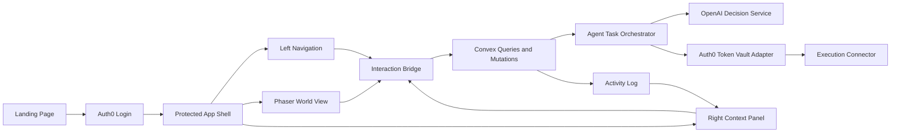

# System Architecture

## Recommended Stack

- App shell and marketing site: Next.js with App Router and TypeScript
- World renderer: Phaser
- Styling: Tailwind CSS plus design tokens
- Auth: Auth0
- Delegated execution boundary: Auth0 Token Vault adapter
- Backend data and realtime sync: Convex
- AI reasoning: OpenAI API via backend actions
- Client state: lightweight store plus server-backed data

## Why This Stack

### Next.js

One app can host both the landing page and protected product surface without split deployment complexity.

### Phaser

Fastest route to a game-like world that still lives comfortably inside a product dashboard.

### Convex

Excellent for realtime activity, event streams, and simple mutation workflows during a hackathon.

### Auth0

Critical to the hackathon's trust and delegated-action story.

## High-Level Architecture

## Route Strategy

- `/`: landing page
- `/app`: protected dashboard home
- `/app/world`: main world route
- `/app/activity`: activity-focused route using the same shell
- `/app/settings`: profile, policy, and agent settings

The shell should be shared across all `/app` routes so the left rail and panel patterns remain consistent.

## Core Boundaries

### UI Shell

Owns layout, navigation, session-aware rendering, and panel states.

### World Renderer

Owns visual scene, entity highlighting, and interaction emission.

### Application State

Owns selected entity, active mission, approval state, and current task.

### Backend Orchestrator

Owns durable state, policy checks, activity events, and AI or execution calls.

## Anti-Dead-End Decisions

1. Phaser never owns canonical business state.
2. The right panel is driven by typed view models, not ad hoc conditionals.
3. The world is data-driven through entity configs.
4. Real execution sits behind an adapter so the demo can fall back to mock mode cleanly.
5. Auth comes before world complexity.

## Technical Flow For A Mission

1. User launches a mission from the left rail or a world hotspot.
2. Frontend creates a task request.
3. Convex stores the task as `queued`.
4. Backend orchestrator enriches the task with policy and catalog data.
5. OpenAI decision service returns a structured choice and reason.
6. If policy says low risk, execute directly through the execution adapter.
7. If policy says step-up required, create approval state and wait.
8. Log every transition to the activity stream.

## MVP Deployment Shape

- One frontend deployment
- One Convex environment
- One Auth0 tenant for the hackathon
- Optional mock external commerce connector

## What We Are Deliberately Avoiding

- Separate microservices
- Standalone game client
- World logic mixed with purchase execution logic
- Tight coupling between auth provider specifics and UI components
